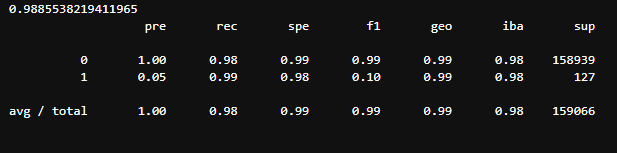
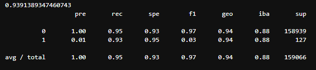
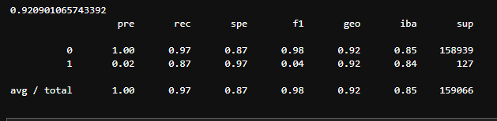

# Comparison of Machine Learning Models to detect Money Laundering

## Overview of the Analysis

* Several Machine Learning Models were compared to determine which one was most successful at predicting fraudulent transactions.
* The dataset was simulated financial data from [kaggle.com](https://www.kaggle.com/ealaxi/paysim1). The columns included information about banking transactions (type of transaction, amount, origination, destination, and whether it was fraudulent).
* In our dataset the target dataset was very imbalanced (635772 rows that were not fraudulent vs. 490 rows that were fraud).
* We used a subset of the original dataset (2%) to feed into the `LazyClassifier` module in order to point us toward the top performing Classification machine learning models.
* We then ran a larger subset of the data (approx 10%) through the top three models as proposed by Lazy Predict's `LazyClassifier`. The three models chosen were: `AdaBoostClassifier`, `LinearSVC` and `LogisticRegression`.
* We used imbalanced-learn's `RandomOverSampler` function to balance the 'fraud' and 'not fraud' classes before training the models.

## Results

* `AdaBoostClassifier`:

* `LinearSVC`:

  
* `LogisticRegression`:

## Summary

Based on the above scores, we recommend using the AdaBoostClassifier to process this sort of data. Otherfactors that are worth discovering is how much data is needed to effectively train the model, i.e. at what point does the accuracy score plateau. There's no need for the company to spend more on training data than necessary.
