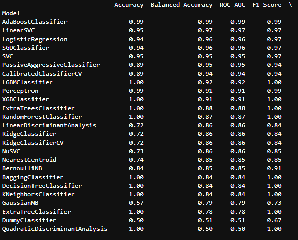

# Machine Learning in Anti-Money Laundering (AML)
UNCC Online FinTech Bootcamp Module 16 Project due by 11:59pm 3/27/2022


Image from [Infosys Consulting](https://www.infosysconsultinginsights.com/2020/01/15/transforming-anti-money-laundering-and-kyc-controls-with-ai-part-i/)

---

## Executive Summary

---

## Background

Problem: Traditional Rule-based systems generate a high number of false positives which uses a lot of resources for a banking institution. Goal: to reduce false positives, and uncover criminal activity that goes undetected with traditional rules-based systems.

Traditional rules-based engines typically function off a set of mathematical conditions to determine what decisions to formulate. For example, if an account were to show more than N amount in N amount of days, issue a flag. The positive is that analysts can swiftly create and execute new rules based on past fraudulent transactions, thus making it easier to demonstrate to regulators why a specific transaction was flagged. The downsides on the contrary, outweigh such clarity and consistency. A clear set of conditions gives criminals guidelines to purposely avoid in order to go undetected, produces excessive false positives, must be regularly maintained, and disregards relationships between transactions - to name some of the issues.

This is where machine learning models come in. ML models strengthen systems through reduced false positives, fewer false negatives, faster processing speed, and the ability to adapt and learn with continuous data. Here is how they work:
1. Massive historical datasets regarding transactions are fed through algorithms to "train" the machine in detecting fraudulent transactions.
2. Machine Learning algorithms use this training data to compare with expected values.
3. 

---

## What's Being Created

We started with simulated financial data from [kaggle.com](https://www.kaggle.com/ealaxi/paysim1). The columns included information about banking transactions (type of transaction, amount, origination, destination, and whether it was fraudulent).

We created a Jupyter Lab [notebook](AML_data_analyzer.ipynb) that performed the following:
 1. Loaded the original dataset of simulated financial transactions;
 2. Reduced the dataset for easier processing through Lazy Predict's `LazyClassifier` function. We took a random percentage of the original data. The file size was an issue loading to GitHub.
 3. Split, scaled, and upsampled the data.
 4. Fed through `LazyClassifier` to determine what models worked best with this data.
 
Ultimately, we created a separate Jupyter [notebook](create_sample_subset.ipynb) to reduce the size of the dataset, using the pandas `sample` function to grab a specified `frac`tion of the dataset, as in these two lines of code:
 ```python
subset_fraction = 0.02
subset = df.sample(frac=subset_fraction)
 ```


---

## Technologies

This application is written in Python 3.7 using JupyterLab version 3.0.14.

Python libraries used:

 - [Pandas](https://pandas.pydata.org/pandas-docs/stable/) - *an open source, BSD-licensed library providing high-performance, easy-to-use data structures and data analysis tools for the Python programming language.*
 - [Pathlib](https://docs.python.org/3.7/library/pathlib.html) - *a library that enables consistent input and output of files from the main app.*
 - [scikit-learn](https://scikit-learn.org/stable/user_guide.html) - *an open source machine learning library that supports supervised and unsupervised learning.*
 - [imbalanced-learn](https://pypi.org/project/imbalanced-learn/) *a python package offering a number of re-sampling techniques commonly used in datasets showing strong between-class imbalance.*
 - [Lazy Predict](https://lazypredict.readthedocs.io/en/latest/) - *helps build a lot of basic models without much code and helps understand which models works better without any parameter tuning.*
 - [Matplotlib](https://matplotlib.org/) *a comprehensive library for creating static, animated, and interactive visualizations in Python.*

### Installation Guide

prior to running these libraries, install them from the command line:
  - pandas: `conda install pandas` or `pip install pandas`  
  - pathlib: `pip install pathlib`
  - sklearn: `pip install-U scikit-learn` - included in conda
  - imblearn: `pip install -U imbalanced-learn` or `conda install -c conda-forge imbalanced-learn`
  - Lazy Predict: `pip install lazypredict`
  - matplotlib: `conda install matplotlib` or `pip install matplotlibg`
  
---
  
## Results

After running the `LazyClassifier` function from Lazy Predict module, we had a ranking of which models did best at predicting fraud:



We then used the top 3 models to run larger portions of the original dataset, and then set up a user interface using StreamLit to allow for a user to select which model they'd prefer to run.

---

## Contributors

John Felder - @johnfelder

Charles-Dylan Mactutus - @cmactut

Geoff Tarleton - jobeycat@protonmail.com

---

## License

[MIT](LICENSE)
